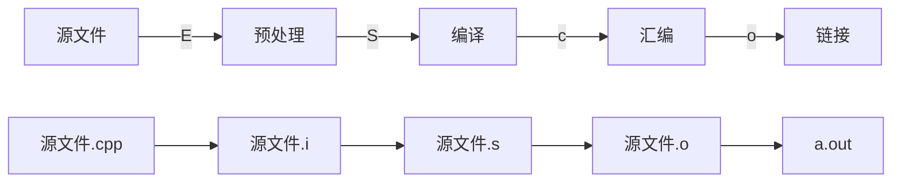

### 1. 从源码到可执行文件，一个文件到底经历了什么



还是不太明白，文字都懂，不具体不客观。让我们来看个小例子

现在让我们写一个很小的cpp文件: 内容如下

```c++
#include <iostream>
using namespace std;

int main() {
#ifdef YXY_BUILD
    cout << "hello yuanxinying" << endl;
#else
    cout << "hello others" << endl;
#endif
    return 0;
}
```

```bash
g++ -E hello.cpp >& hello.i // 预处理命令
```


那么假如我们稍微换一条命令

```bash
g++ -E -DYXY_BUILD hello.cpp  >& hello.i // 事情会变成什么样子呢
```


所以，在预处理环节，我们代码所需要的一些系统变量如size_t, ptrdiff_t、一些系统**头文件以及编译宏**都会被展开。而此时也将会冒出一系列的问题，比如头文件找不到。


那现在又来了一个问题？凭什么系统的头文件就能找到呢？我自己写的头文件为啥找不到？

```bash
g++ -xc++ -E -v - // 快速试试这条命令, 系统头文件
```

有什么法子可以解么？

```bash
g++ -IyourHeaderDir // 试试这条命令，当然在现在的构建系统中已经不再用这么原始的模式来实现头文件的包含了。一些基于人文语义的封装已经越来越流行e.g INCLUDE_DIRECTORY() 但是翻译成为底层的命令都是一样的
```

所以当你遇到头文件报错的时候不要害怕，仔细通过它的构建语言去找路径，终究会找到

**"" 和<>的区别是啥？ 谁的搜索范围更大一些。将<iostream>换成"iostream" 程序还能正常运行么?**

```bash
对于使用双引号的头文件，查找头文件路径的顺序为：
1，当前头文件目录
2，编译器设置的头文件路径（编译器可使用-I显式指定搜索路径）
3，系统变量CPLUS_INCLUDE_PATH/C_INCLUDE_PATH指定的头文件路径

对于使用尖括号包含的头文件，查找头文件的路径顺序为：
1，编译器设置的头文件路径（编译器可使用-I显式指定搜索路径）
2，系统变量CPLUS_INCLUDE_PATH/C_INCLUDE_PATH指定的头文件路径
```

讲完了预处理，让我们来看下编译指令-S

``` 
g++ -S hello.cpp >& hello.s
```

现在我们得到了一堆寄存器类似的代码片段


**有咩有发现栈的生长方向是由高向低的？_malloc函数为啥没有看到实现?**

讲完了编译，我们来看看下一个过程汇编。这一步骤是将上一步骤的汇编语言转化成为机器码

```bash
g++ -c Hello.cpp // 产物是Hello.o 已经没法用vim打开这个文件了
```

然后还有下一个过程链接

```ba
g++ -o Hello.cpp // 产物是a.out 
```

 所以汇编产生的文件和链接产生的文件到底有什么差别？


```c++
objdump -x binaryFile | grep NEEDED // 在大多数linux发行版本中自带的工具
```

### 2. 如何编译出来一个so, so该怎么用

```bash
 g++ UtilsLib.cpp -I./public -shared -fPIC -o libUtils.so //编译出来so
 
 g++ -c TestShare.cpp -I./libs/public // 可以正常汇编
 g++ TestShare.cpp -o testshare -I./libs/public // 但是无法正常链接->找不到函数定义
 
 g++ TestShare.cpp -lUtils -L./libs/ -I./libs/public  // successfuly   
 // 所以你看，在c++的工程逻辑里面，声明和实现是分离的。头文件提供声明，so或者.a提供实现。要想功能正常，缺一不可
```


```bash
运行时依赖 请添加LD_LIBRARY_PATH变量 export LD_LIBRARY_PATH=/home/y00521261/Compiler/libs/ (for linux)
export DYLD_LIBRARY_PATH=/home/y00521261/Compiler/libs/ (for mac)
```

### 3. .so和.a有啥区别

```bash
g++ -c UtilsLib.cpp -Ipublic
ar crv ligUtils.a  UtilsLib.o

g++ TestShare.cpp ./libs/ligUtils.a  -o main_static -I./libs/public 
./main_static
```


